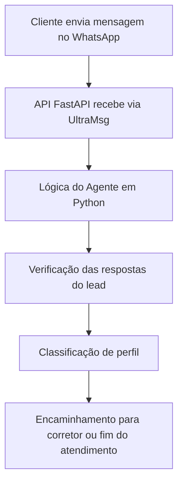

# 🧠 Corretor Inteligente para o Mercado Imobiliário

Este projeto apresenta um **agente inteligente automatizado** para **qualificação de leads no WhatsApp**, voltado para corretores e imobiliárias que desejam automatizar o atendimento inicial, realizar triagem de clientes e otimizar a etapa de simulação de financiamento — antes mesmo do contato humano.

---

## 🚀 O que esta solução faz?

- **Responde de forma humanizada** às mensagens recebidas pelo WhatsApp  
- **Simula digitação**, trazendo naturalidade ao atendimento  
- **Coleta dados do lead**: idade, renda, dependentes, estado civil, FGTS, imóvel atual  
- **Verifica elegibilidade ao Minha Casa Minha Vida**  
- **Redireciona apenas leads qualificados para o corretor humano**  
- **Gera base de dados estruturada para CRM ou planilha**  
- **Preparado para integração com LLMs e APIs externas**

---

## ⚙️ Tecnologias Utilizadas

- **Python** – para a lógica principal  
- **FastAPI** – criação da API REST  
- **UltraMsg (WhatsApp API)** – envio e recebimento de mensagens  
- **AWS EC2 (T2.micro)** – hospedagem  
- **Uvicorn** – servidor ASGI  

---

## 🧠 Exemplo de Conversa

```text
Bot: Oi! Claro, posso te ajudar com isso.  
Antes de tudo, preciso saber se conseguimos simular um financiamento pra você. Posso te fazer algumas perguntas rápidas?

Bot: Legal! Qual sua idade?

Bot: Obrigado! Agora me diga sua renda mensal (individual ou somada com alguém)?

Bot: Perfeito. Você possui pelo menos 3 anos de FGTS recolhido?

# ...continua com base no fluxo inteligente até chegar na simulação ou redirecionamento.
```

---

## ☁️ Fluxo do Projeto



---

## ✅ Status Atual

- [x] Estrutura da API em FastAPI  
- [x] Função de simulação de digitação  
- [x] Coleta de dados via fluxo interativo  
- [x] Primeira versão da lógica de qualificação  
- [ ] Integração com CRM (em planejamento)  
- [ ] Geração automática de leads qualificados em planilhas  
- [ ] Integração com LLMs para respostas adaptativas  

---

## 📁 Estrutura do Projeto

```
📦 corretor-inteligente
├── app/
│   ├── main.py               # FastAPI com rotas ativas
│   ├── chat.py               # Lógica de diálogo com o lead
│   ├── regras.py             # Regras do MCMV, simulações, triagens
│   └── utils.py              # Funções auxiliares e simulador de digitação
```

---

## 🔧 Como Executar Localmente

```bash
# 1. Criar ambiente virtual (opcional, mas recomendado)
python3 -m venv venv
source venv/bin/activate

# 2. Instalar dependências
pip install -r requirements.txt

# 3. Rodar a aplicação FastAPI
uvicorn main:app --host 0.0.0.0 --port 8001
```

---

## ⏭️ Próximas Etapas

- Aprimorar o fluxo de conversa com mais ramificações  
- Criar integração com planilha Google para armazenar os leads  
- Implementar respostas automáticas por perfil de lead  
- Conectar com CRM  
- Integrar com LLM para personalização mais avançada

---

<p align="center">
  <a href="https://rodrigo-rrc.github.io/Projetos_IA/" target="_blank">
    
  </a>
</p>

---

## 👨‍💻 Autor

**Rodrigo Ribeiro Carvalho**  
GitHub: [Rodrigo-RRC](https://github.com/Rodrigo-RRC)  
LinkedIn: [linkedin.com/in/rodrigo-ribeiro-datascience](https://linkedin.com/in/rodrigo-ribeiro-datascience)  
WhatsApp: [Clique aqui para conversar](https://wa.me/5547991820339)

---

## ✅ Licença

Este projeto é de uso livre e educacional. A comercialização só é permitida com autorização expressa do autor.